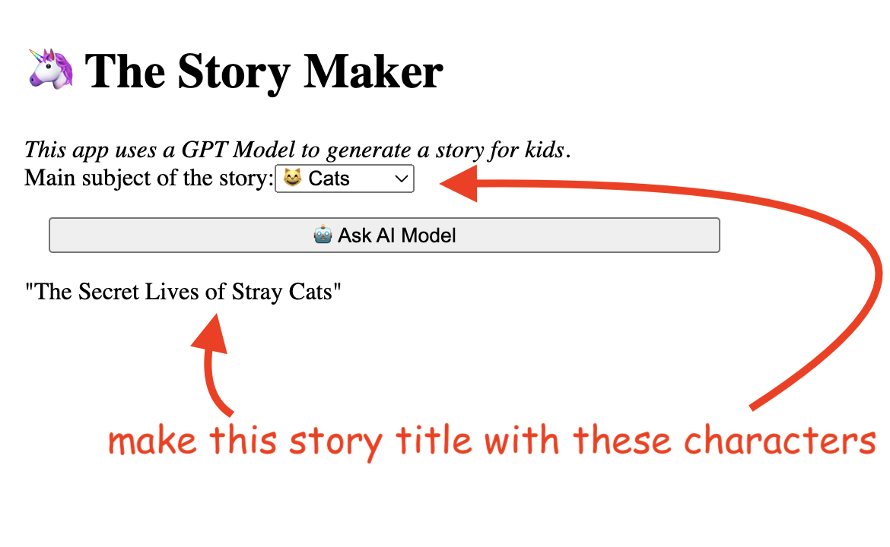

## 2. Model, Prompt, dan Chain

# 2.1. Pendahuluan

Saatnya membuat aplikasi pertama kita menggunakan LangChain dan JavaScript.

Anda telah ditugaskan untuk membuat aplikasi bernama "The Story Maker". Aplikasi ini akan menghasilkan judul untuk cerita anak-anak. Berikut adalah tampilan UI akhir aplikasi:



Misalnya, jika kita menentukan bahwa kita ingin cerita dengan Unicorn sebagai karakter utama, aplikasi akan menghasilkan judul cerita seperti ini:

"Petualangan Ajaib Stardust si Unicorn"

## 2.2. Memulai

Cara termudah untuk memulai adalah dengan menggunakan utilitas create-next-app. Setelah Anda menginstalnya, buat proyek baru bernama story-generator:

```
npx create-next-app
```

Atau, Anda dapat menggunakan kode awal dari folder contoh kode. Ingatlah untuk menjalankan npm install dari dalam folder contoh.

Kita perlu menginstal beberapa dependensi npm: LangChain dan OpenAI. Pergi ke folder root proyek dan, di terminal Anda, jalankan perintah berikut:

```
npm i langchain @langchain/openai
```

Pada saat penulisan buku ini, ini adalah versi modul yang terinstal saat ini:

```
"@langchain/openai": "^0.0.14",
"langchain": "^0.1.19",
```

Harap dicatat bahwa LangChain saat ini sedang dalam pengembangan pesat, dan seiring perkembangannya, bagian-bagian tertentu dari kode mungkin menjadi usang. Saya berusaha untuk menjaga buku tetap diperbarui, tetapi jika, karena alasan apa pun, ada yang rusak, mungkin bijaksana untuk kembali ke nomor versi ini.

Setelah dependensi diatur, kita akan melanjutkan untuk membuat frontend aplikasi kita menggunakan React.

Sisipkan kode berikut ke dalam src\App.js:

```javascript
// code/story-generator/src/app/page.js
"use client"

export default function Home() {
  const onSubmitHandler = async (event) => {
    event.preventDefault()
    const subject = event.target.subject.value

    console.log(subject)
  }

  return (
    <>
      <h1>The Story Maker</h1>

      <em>Aplikasi ini menggunakan Model GPT untuk menghasilkan cerita untuk anak-anak.</em>

      <form onSubmit={onSubmitHandler}>
        <label htmlFor="subject">Subjek utama cerita: </label>

        <input name="subject" placeholder="subjek..." />

        <button>Tanya Model AI</button>
      </form>
    </>
  )
}
```

Tidak ada yang terlalu luar biasa pada tahap ini. Ini hanya UI React yang mengambil subjek cerita dari input teks dan mencatatnya ke konsol.

Kita akan meluncurkan aplikasi kita dengan menjalankan perintah berikut di terminal:

```
npm run dev
```

Ini akan menghasilkan output berikut:

Saat ini, jika pengguna memasukkan subjek, tidak ada cerita yang akan dihasilkan karena kita belum mengintegrasikan aplikasi dengan OpenAI. Kita akan membahas ini di bab berikutnya.

## 2.3. Kunci API untuk model OpenAI ChatGPT

Untuk menggunakan model ChatGPT OpenAI, Anda akan memerlukan kunci API. API ini berbasis langganan dan kunci dapat dibuat dari URL berikut:

https://platform.openai.com/api-keys

Anda dapat mengisi ulang akun Anda dengan nilai minimum. Misalnya, menulis semua contoh dalam buku ini menghabiskan biaya kurang dari 2 USD.

Setelah Anda membuat kunci API Anda, kembali ke proyek Next.js dan tempelkan ke dalam file .env:

```
// code/story-generator/.env

OPENAI_API_KEY='sk-1234567890B2tT4HT3BlbkFJXkATN1arB9DXABkRQ1uj'
```

Kunci ini hanya akan digunakan di bagian backend aplikasi kita. Untuk mengakses kunci API di file code/story-generator/src/app/api/route.js kita dapat menulis sebagai berikut:

```javascript
// code/story-generator/src/app/api/route.js
console.log(process.env.OPENAI_API_KEY)
```

Kunci akan kemudian diteruskan ke objek model LangChain.

Langkah ini akan menjadi prosedur default untuk setiap contoh kode di bab-bab berikutnya dari buku ini.

Jika Anda tidak ingin menggunakan kunci API, Anda dapat melihat daftar ini](https://js.langchain.com/docs/modules/model_io/models/) dengan LLM yang didukung oleh LangChain dan memilih model gratis. Anda bahkan dapat menggunakan token HuggingFace gratis untuk menghindari API OpenAI.

## 2.4. Menggunakan model ChatOpenAI LangChain

Mari kita lanjutkan dengan membangun koneksi ke LLM OpenAI. Tambahkan kode berikut ke backend aplikasi, di file `src/app/api/route.js`:

```javascript
// code/story-generator/src/app/api/route.js

import { ChatOpenAI } from "@langchain/openai"

const model = new ChatOpenAI({
  openAIApiKey: process.env.OPENAI_API_KEY,

  temperature: 0.9,
})

export async function POST(req) {
  const { subject } = await req.json()

  const gptResponse = await model.invoke(subject)

  return Response.json({ data: gptResponse })
}
```

Untuk memulai koneksi dengan OpenAI, kita membuat instance baru dari objek ChatOpenAI. Di dalam konstruktornya, kita mendefinisikan berikut ini:

parameter suhu, diatur ke `0.9`

kunci API yang diperoleh dari subbab sebelumnya

Anda mungkin penasaran dengan parameter suhu ini, bukan?

Parameter suhu memengaruhi seberapa imajinatif model kita.

Meningkatkannya menghasilkan output yang lebih kreatif sementara menurunkannya menjaga respons lebih membumi dan faktual. Berpegang pada fakta mengurangi potensi ketidakakuratan atau halusinasi dari model.

Memilih suhu yang tepat tergantung pada tugas. Untuk brainstorming judul cerita yang menarik, suhu yang lebih tinggi lebih disukai. Untuk tugas di mana akurasi adalah kunci seperti meringkas dokumen hukum, suhu yang lebih rendah lebih baik.

### Dengan suhu yang telah kita atur, mari kita perbarui frontend aplikasi kita:

```javascript
// code/story-generator/src/app/page.js

export default function Home() {
  const onSubmitHandler = async (event) => {
    event.preventDefault()

    const subject = event.target.subject.value

    // panggil LLM dengan subjek sebagai prompt utama
    const response = await fetch("api", {
      method: "POST",

      body: JSON.stringify({ subject }),
    })

    // destructure dan cetak data respons
    const { data } = await response.json()

    console.log(response)
  }

  // sisanya tetap sama

  // ...
}
```

Untuk menguji, mari kita masukkan pertanyaan umum seperti Siapa Elsa? Sebagai jawaban, kita akan menerima:

"Elsa adalah karakter fiksi dan protagonis dari film animasi Disney, Frozen. Dia adalah ratu Arendelle dan memiliki kemampuan magis untuk menciptakan es dan salju."

Ini mengkonfirmasi koneksi sukses kita ke OpenAI.

Harap dicatat bahwa jawaban Anda mungkin sedikit berbeda. Berlawanan dengan cara pemrograman klasik, LLM dapat memberikan output yang berbeda untuk input yang sama.

LLM bekerja dengan memperkirakan sesuatu, semuanya bersifat probabilistik.

Uji coba lain bisa melibatkan permintaan judul cerita seperti:

"Beritahu saya judul cerita pengantar tidur tentang unicorn."

Atau:

"Beritahu saya judul cerita pengantar tidur tentang kucing."

Cobalah dan lihat bagaimana hasilnya.

## 2.5. Template prompt

Anda akan segera menyadari bahwa prompt memerlukan input yang berulang, seperti Beritahu saya judul cerita pengantar tidur tentang ... diikuti oleh subjek utama.

Redundansi ini dapat diatasi menggunakan template prompt, yang akan kita jelajahi selanjutnya.

Sebelum kita beralih ke bab berikutnya, mari kita tambahkan sedikit perubahan pada aplikasi kita. Akan menampilkan judul cerita yang diberikan oleh LLM di UI menggunakan variabel status React.

Ini adalah kode lengkap dengan penambahan yang disorot:

//code/story-generator/src/app/page.js

```javascript
"use client"

import { useState } from "react"

export default function Home() {
  // menambahkan variabel status React
  const [storyTitle, setStoryTitle] = useState()

  const onSubmitHandler = async (e) => {
    e.preventDefault()

    const subject = e.target.subject.value

    const response = await fetch("api", {
      method: "POST",

      body: JSON.stringify({ subject }),
    })

    const { data } = await response.json()

    // perbarui status React ketika kita memiliki jawaban LLM
    setStoryTitle(data)
  }

  return (
    <>
      <h1>The Story Maker</h1>

      <em>Aplikasi ini menggunakan Model GPT untuk menghasilkan cerita untuk anak-anak.</em>

      <form onSubmit={onSubmitHandler}>
        <label htmlFor="subject">Subjek utama cerita: </label>

        <input name="subject" placeholder="subjek..." />

        <button>Tanya Model AI</button>
      </form>

      {/* tampilkan judul cerita di UI */}

      <p>{storyTitle}</p>
    </>
  )
}
```

Dan ini adalah bagaimana UI akan terlihat setelah perubahan:

Mari kita kembali ke konten utama bab ini: template prompt.

Model bahasa menggunakan teks sebagai input. Teks itu disebut prompt. Namun, itu bukan hanya string tetap. Biasanya, itu adalah campuran dari template, contoh, dan apa yang ditambahkan pengguna.

Dengan template, kita dapat menyederhanakan proses prompting, memastikan bahwa pengguna tidak perlu berulang kali mengetik awalan yang sama untuk setiap permintaan.

Untuk kasus penggunaan khusus kita, template prompt akan terlihat seperti ini:

`Beritahu saya judul cerita tentang {subject}`

Semua perubahan yang perlu kita buat ada di backend:

//code/story-generator/src/app/api/route.js

```javascript
import { ChatOpenAI } from "@langchain/openai"

// kita akan menggunakan PromptTemplate untuk menghindari pengulangan
import { PromptTemplate } from "@langchain/core/prompts"

const model = new ChatOpenAI({
  openAIApiKey: process.env.OPENAI_API_KEY,

  temperature: 0.9,
})

// menetapkan format umum template
const prompt = new PromptTemplate({
  inputVariables: ["subject"],

  template: "Beritahu saya judul cerita tentang {subject}",
})

export async function POST(req) {
  const { subject } = await req.json()

  // meneruskan parameter { subject }
  const formattedPrompt = await prompt.format({
    subject,
  })

  const gptResponse = await model.invoke(formattedPrompt)

  return Response.json({ data: gptResponse.content })
}
```

Format default penulisan template prompt adalah format F-String, populer di Python. Jika Anda ingin menggunakan format JavaScript Mustache kurung kurawal ganda yang lebih familiar, Anda bisa memiliki:

```javascript
const prompt = PromptTemplate.fromTemplate("Beritahu saya judul cerita tentang {{subject}}", {
  inputVariables: ["subject"],
  templateFormat: "mustache",
})
```

Jika Anda ingin membaca lebih lanjut, Anda dapat melihat panduan mulai cepat dari dokumentasi.
