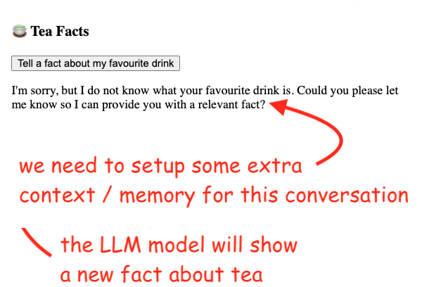
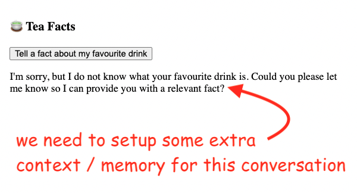
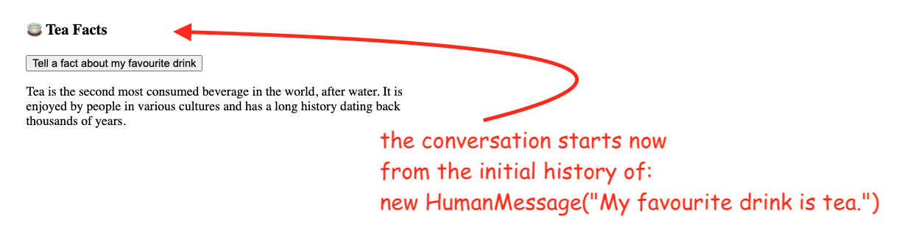
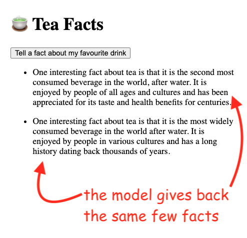
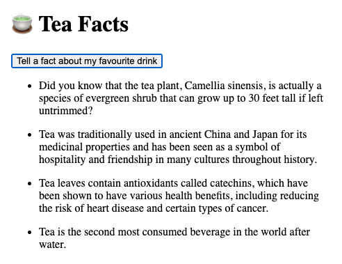

# 5. Memori obrolan

## 5.1. Pendahuluan dan pengaturan proyek

Fitur memori obrolan memungkinkan Model Bahasa Besar (LLM) untuk mengingat interaksi sebelumnya dengan pengguna.

Memori percakapan adalah bagaimana chatbot dapat menanggapi beberapa pertanyaan dengan cara seperti obrolan. Tanpa itu, setiap pertanyaan akan diperlakukan sebagai input independen tunggal tanpa mempertimbangkan interaksi sebelumnya.

Pertanyaan lanjutan hanya masuk akal ketika mereka merujuk pada pertanyaan dan jawaban sebelumnya. Misalnya, jika saya hanya mengatakan kepada LLM "Jelaskan secara rinci" ia akan meminta lebih banyak konteks. Tetapi jika saya pertama kali memberi tahu LLM yang sama "Bagaimana kecepatan cahaya dihitung" diikuti dengan "Jelaskan secara rinci" saya akan mendapatkan jawaban yang koheren.

Secara default, LLM tidak memiliki status. Setiap kueri yang masuk diproses secara independen dari interaksi lain. Satu-satunya hal yang ada untuk entitas tanpa status adalah input saat ini dan tidak ada yang lain.

Anda bekerja dengan toko teh dan telah ditugaskan untuk membuat aplikasi bertenaga GPT yang menyediakan fakta menarik tentang teh kepada pengguna. Di bawah ini adalah gambar seperti apa versi akhir aplikasi itu:



Kita akan mulai dengan pengaturan berikut.

Di frontend, kita memiliki tombol yang membuat permintaan POST ke API dan mencetak jawabannya:

```javascript
// code/tea-wiki/src/app/page.js

"use client"

import { useState } from "react"

export default function Home() {
  const [answer, setAnswer] = useState()

  const tellFact = async () => {
    const response = await fetch("api", {
      method: "POST",
    })

    const { data } = await response.json()

    setAnswer(data)
  }

  return (
    <>
      <h1>+ Fakta Teh</h1>
      <button onClick={tellFact}>Beritahu fakta tentang minuman favorit saya</button>

      <div>{answer}</div>
    </>
  )
}
```

Sementara di backend, kita mengembalikan jawaban yang diberikan oleh model GPT ke prompt "Beritahu fakta tentang minuman favorit saya":

```javascript
// code/tea-wiki/src/app/api/route.js

import { ChatOpenAI } from "@langchain/openai"

import { ChatPromptTemplate } from "@langchain/core/prompts"

import { StringOutputParser } from "@langchain/core/output_parsers"

const model = new ChatOpenAI({
  openAIApiKey: process.env.OPENAI_API_KEY,
  temperature: 0.9,
})

const prompt = ChatPromptTemplate.fromMessages([["human", "{input}"]])

const outputParser = new StringOutputParser()

const chain = prompt.pipe(model).pipe(outputParser)

export async function POST() {
  const question = `Beritahu fakta tentang minuman favorit saya.`

  const fact = await chain.invoke({
    input: question,
  })

  return Response.json({ data: fact })
}
```

## 5.2. Menyuntikkan pesan ke dalam memori percakapan

Sejak awal jelas bahwa kita memiliki masalah:


Saat memanggil chain, kita dapat menggunakan properti `chat_history` untuk mengatur konteks memori untuk percakapan yang sedang berlangsung.

Mari kita lihat bagaimana kita bisa melakukan ini!

Di bawah ini adalah kode yang diperbarui untuk backend:

```javascript
// code/tea-wiki/src/app/api/route.js

import { ChatOpenAI } from "@langchain/openai"

import { ChatPromptTemplate } from "@langchain/core/prompts"

import { StringOutputParser } from "@langchain/core/output_parsers"
// Tambahkan impor HumanMessage, dan MessagesPlaceholder
import { HumanMessage } from "@langchain/core/messages"

import { MessagesPlaceholder } from "@langchain/core/prompts"

const model = new ChatOpenAI({
  openAIApiKey: process.env.OPENAI_API_KEY,
  temperature: 0.9,
})
```

## 5.2.1. Konteks memori percakapan awal

```javascript
const chatHistory = [new HumanMessage(`Minuman favorit saya adalah teh.`)]

const prompt = ChatPromptTemplate.fromMessages([
  // Kita perlu memberi tahu prompt bahwa ia akan memiliki memori
  new MessagesPlaceholder("chat_history"),

  ["human", "{input}"],
])

const outputParser = new StringOutputParser()

const chain = prompt.pipe(model).pipe(outputParser)

export async function POST() {
  const question = `Beritahu fakta tentang minuman favorit saya.`

  const fact = await chain.invoke({
    input: question,
    // Hubungkan array chatHistory dengan prompt
    chat_history: chatHistory,
  })

  return Response.json({ data: fact })
}
```

Kunci di sini adalah objek `MessagesPlaceholder`. Kita dapat mengatur placeholder pesan yang berbeda untuk prompt.

Misalnya, kita dapat menggunakan placeholder pesan scratchpad agen untuk menyimpan "pikiran" agen AI. Jangan khawatir, kita akan berbicara lebih banyak tentang agen AI di bab-bab berikutnya.

Dalam kasus ini, kita akan menggunakan `MessagesPlaceholder` dengan `chat_history` untuk menunjukkan kepada prompt bahwa ia tidak tanpa status dan memiliki riwayat sebelumnya.

## 5.2.2. Memperbarui frontend untuk melacak riwayat percakapan

`chatHistory` hanyalah array sederhana di mana kita dapat menyimpan riwayat percakapan dengan objek `HumanMessage` dan `AIMessage`. Pada akhirnya, konten objek-objek ini hanya terdiri dari string sederhana dengan beberapa pemformatan tambahan.

Dengan perubahan ini, model sekarang akan tahu bahwa minuman favorit kita adalah teh:



Bagus! Satu langkah maju!

Namun, kita sekarang menghadapi masalah lain. Mari kita lihat apa yang terjadi setelah kita meminta beberapa fakta.

Untuk mengimplementasikan penyimpanan fakta sebelumnya, kita hanya mengubah frontend. Kita akan melacak dan menampilkan semua respons sebelumnya yang diberikan oleh model:

```javascript
// code/tea-wiki/src/app/page.js

"use client"

import { useState } from "react"

export default function Home() {
  // Ganti jawaban dengan array fakta
  const [facts, setFacts] = useState([])

  const tellFact = async () => {
    const response = await fetch("api", {
      method: "POST",
    })
    const { data } = await response.json()
    // Tambahkan fakta baru ke array
    setFacts([data, ...facts])
  }

  return (
    <>
      <h1>+ Fakta Teh</h1>
      <button onClick={tellFact}>Beritahu fakta tentang minuman favorit saya</button>

      <ul>
        {
          // Tampilkan array
          facts.map((fact, i) => (
            <li key={i}>{fact}</li>
          ))
        }
      </ul>
    </>
  )
}
```

Model terus memberikan beberapa fakta lama yang sama, seperti kakek tua yang terus mengulang cerita yang sama berulang kali.



Kita bisa mencoba memperbarui prompt, tetapi itu tidak akan membantu:

## 5.2.3. Mengapa mengubah prompt tidak akan memperbaiki duplikasi

```javascript
// Mengubah prompt tidak akan memperbaiki duplikasi

const response = await chain.invoke({
  input: `Beritahu fakta tentang minuman favorit saya.
   Jangan ulangi fakta sebelumnya.`,
  chat_history: chatHistory,
})
```

Ingatlah bahwa LLM tidak memiliki status — artinya setiap kueri yang masuk diproses secara independen dari interaksi lain. Untuk model tanpa status, satu-satunya hal yang ada adalah input saat ini. Tidak ada yang lain.

Ini terjadi karena kita hanya memberikan pesan awal (Minuman favorit saya adalah teh.). Kita juga perlu memperbarui riwayat pesan seiring berkembangnya percakapan.

## 5.3. Riwayat percakapan lengkap

Jika Anda melihat bagaimana kita menyimpan riwayat percakapan, itu hanyalah array JavaScript biasa.

```javascript
const chatHistory = [new HumanMessage(`Minuman favorit saya adalah teh.`)]
```

Ini berarti kita dapat dengan mudah menambahkan pesan dengan mendorong item baru ke array:

- pesan dari sisi pengguna, diwakili dengan kelas `HumanMessage`
- respons yang diberikan oleh AI, diwakili oleh kelas `AIMessage`

Saat kita menerima lebih banyak fakta dari model, percakapan akan terlihat seperti ini:

```javascript
;[
  // keadaan awal
  new HumanMessage(`Minuman favorit saya adalah teh.`),

  // pengguna mengklik tombol
  new HumanMessage(`Beritahu fakta tentang minuman favorit saya. Jangan ulangi fakta sebelumnya.`),

  // LLM membalas
  new AIMessage(`Adalah minuman kedua yang paling banyak dikonsumsi di dunia, setelah air...`),

  // pengguna mengklik tombol lagi
  new HumanMessage(`Beritahu fakta tentang minuman favorit saya. Jangan ulangi fakta sebelumnya.`),

  // LLM membalas dengan fakta lain
  new AIMessage(`Adalah minuman kedua yang paling banyak dikonsumsi di dunia, setelah air...`),

  // dan seterusnya
  // ...
  // ...
]
```

## 5.3.1. Implementasi backend lengkap

Untuk langkah ini, tidak akan ada perubahan pada frontend.

Beginilah tampilan kode lengkap backend:

```javascript
import { ChatOpenAI } from "@langchain/openai"

import { ChatPromptTemplate } from "@langchain/core/prompts"

import { StringOutputParser } from "@langchain/core/output_parsers"
// Impor kelas AIMessage untuk menyimpan respons yang diberikan oleh LLM

import { HumanMessage, AIMessage } from "@langchain/core/messages"

import { MessagesPlaceholder } from "@langchain/core/prompts"

const model = new ChatOpenAI({
  openAIApiKey: process.env.OPENAI_API_KEY,
  temperature: 0.9,
})

const chatHistory = [new HumanMessage(`Minuman favorit saya adalah teh.`)]

const prompt = ChatPromptTemplate.fromMessages([new MessagesPlaceholder("chat_history"), ["human", "{input}"]])

const outputParser = new StringOutputParser()

const chain = prompt.pipe(model).pipe(outputParser)

export async function POST() {
  // Perbarui prompt
  const question = `Beritahu fakta tentang minuman favorit saya.
                      Jangan ulangi fakta sebelumnya.`

  // Tambahkan riwayat obrolan percakapan yang dikirim oleh pengguna

  chatHistory.push(new HumanMessage(question))

  const fact = await chain.invoke({
    input: question,

    chat_history: chatHistory,
  })
  // Simpan setiap fakta agar LLM tahu apa yang tidak boleh diulang

  chatHistory.push(new AIMessage(fact))

  return Response.json({ data: fact })
}
```

Setiap kali pertanyaan baru datang dari pengguna, kita akan mendorongnya yang dibungkus dalam objek `HumanMessage`.

Yang lebih penting, kita akan mendorong setiap fakta tentang teh dalam objek `AIMessage`. Ini akan memungkinkan LLM untuk menghindari pengulangan.

Dan beginilah tampilan versi akhir aplikasi kita pada akhirnya:



Tidak ada lagi pengulangan di sini, berkat versi riwayat percakapan yang diperbarui.

## 5.4. Manajemen sesi untuk beberapa percakapan

Sebagai pemikiran terakhir, ingatlah bahwa kita dapat menggunakan parameter konfigurasi `sessionId` dalam metode `invoke()` untuk mengelola beberapa utas percakapan tentang topik yang berbeda:

```javascript
{
  configurable: {
    sessionId: "nilai_id_di_sini"
  }
}
```

Cara aplikasi web OpenAI ChatGPT melakukannya:

Anda dapat membaca detail lebih lanjut tentang ini di sini:
https://js.langchain.com/docs/use_cases/chatbots/memory_management/
