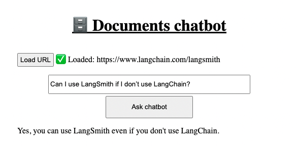
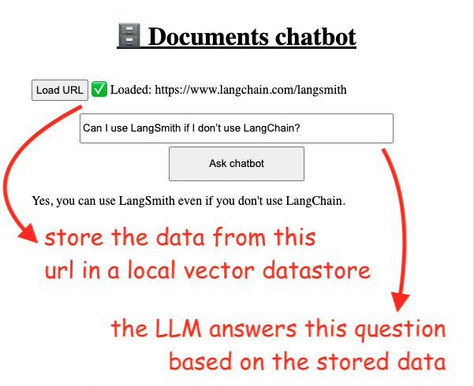
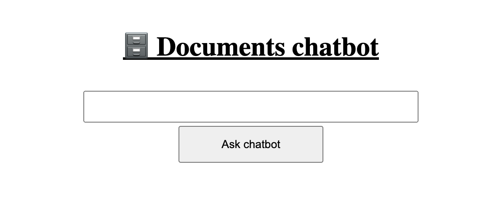
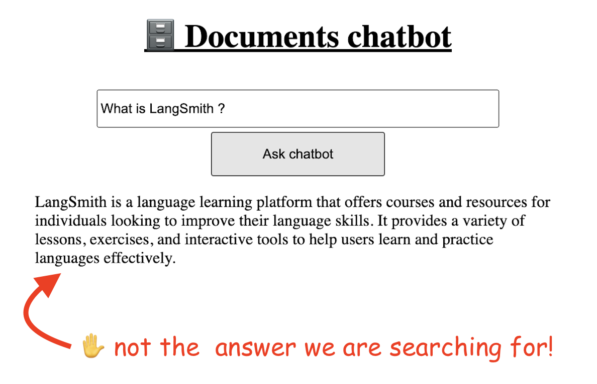
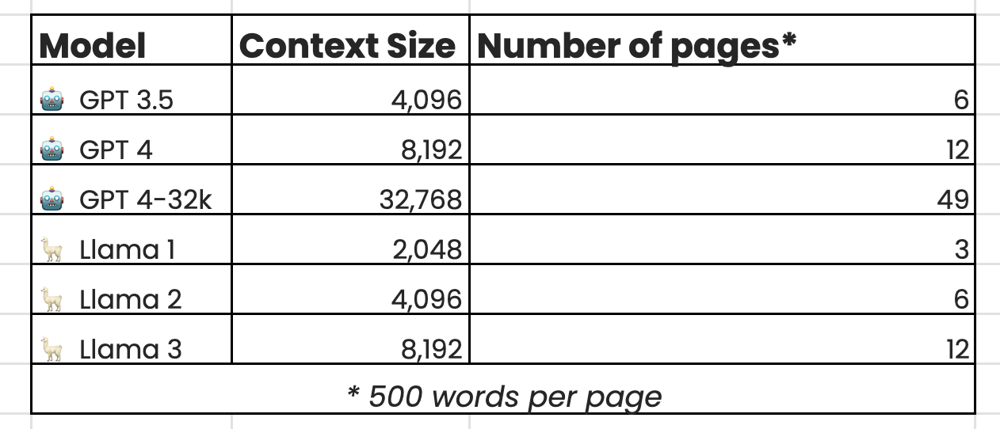
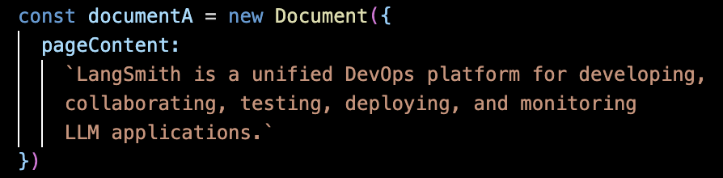

# 6. RAG / Mengobrol dengan dokumen

## 6.1. Pendahuluan

Mari kita bahas topik yang sangat penting dalam bekerja dengan LLM: RAG, singkatan dari Retrieval Augmented Generation.

RAG adalah proses mengoptimalkan output LLM dengan mereferensikan basis pengetahuan di luar sumber data pelatihannya.

Misalnya, tanggal batas pengetahuan untuk ChatGPT 3.5 Turbo adalah September 2021. Ini berarti bahwa, tanpa bantuan eksternal, model tidak akan tahu apa yang terjadi setelah tanggal ini.

Tetapi bagaimana jika kita perlu bekerja dengan informasi tentang LangSmith, alat yang dikembangkan oleh perusahaan yang sama dengan LangChain? Alat baru ini dirilis pada tahun 2023, setelah tanggal batas pengetahuan.

Atau bagaimana jika kita perlu membuat chatbot yang mereferensikan beberapa dokumen internal organisasi untuk memberikan dukungan pelanggan?

Di sinilah RAG berperan. Menggunakan RAG Anda dapat menghubungkan sumber data eksternal seperti file CSV, video, PDF, dll. ke LLM dan memberikan konteks eksternal.

Beberapa pertimbangan tentang RAG:

- RAG tidak melatih ulang model. Ini tidak memperbarui bobot jaringan saraf. Ini hanya memberikan lebih banyak informasi untuk direferensikan oleh model.
- di bab berikutnya, kita akan berbicara tentang Agen AI. Meskipun Agen AI dapat mencari info eksternal, mereka lebih lambat, lebih mahal, dan dapat memberikan output yang tidak dapat diandalkan. Agen AI bagus untuk situasi kompleks dan kasus non-linear if-then-else yang dapat diselesaikan menggunakan berbagai alat.
- Dengan RAG, Anda dapat melakukan proses pengambilan pengetahuan di muka dan memberikan solusi cepat untuk skenario seperti Tanya Jawab.

Tapi mengapa RAG begitu penting?

Pelatihan LLM membutuhkan biaya yang besar. Sangat besar! Misalnya, model Llama 2 dari Meta, dilatih menggunakan 6000 GPU, berjalan selama 12 hari. Pelatihan tersebut menelan biaya sekitar 2 juta USD. Dalam sebagian besar kasus, Anda tidak ingin melatih model Anda dari awal.

Namun, setiap menit berlalu, ada beberapa informasi/pengetahuan yang dihasilkan. Menjaga model tetap diperbarui dengan informasi baru adalah perlombaan yang konstan.

Bahkan fine-tuning membutuhkan banyak waktu.

Apa pilihan lainnya? Gunakan RAG untuk menyediakan hanya sebagian kecil pengetahuan yang kita butuhkan untuk LLM kita.

RAG menghemat waktu dan uang, karena tidak diperlukan pelatihan.

## 6.2. Contoh pengaturan

Kita akan menjelajahi cara menghubungkan LLM dengan dokumen eksternal dengan membangun contoh berikut:



Dalam versi akhirnya, aplikasi kita akan tahu cara melakukan hal berikut:

- membaca sumber data eksternal
- mengekstrak embedding dari teks
- menyimpan embedding dari langkah sebelumnya dalam database vektor lokal
- menjawab pertanyaan berdasarkan informasi ini

Ini akan menjadi aliran data aplikasi:



Di bawah ini adalah pengaturan frontend awal. Kita mengirim pertanyaan dan mencetak responsnya:

```javascript
// code/rag/src/app/page.js

"use client"

import { useState } from "react"

export default function Home() {
  const [answer, setAnswer] = useState()

  const askQuestion = async (e) => {
    e.preventDefault()
    const question = e.target.question.value

    const response = await fetch("api", {
      method: "POST",
      body: JSON.stringify({ question }),
    })

    const { data } = await response.json()

    setAnswer(data)
  }

  return (
    <>
      <h1>, Chatbot Dokumen</h1>
      <form onSubmit={askQuestion}>
        <input name="question" />

        <button>Tanya chatbot</button>
      </form>

      <p>{answer}</p>
    </>
  )
}
```

Sementara di backend kita menggunakan model GPT untuk menjawab pertanyaan:

```javascript
// code/rag/src/app/api/route.js

import { ChatOpenAI } from "@langchain/openai"

import { ChatPromptTemplate } from "@langchain/core/prompts"

import { LLMChain } from "langchain/chains"

const model = new ChatOpenAI({
  openAIApiKey: process.env.OPENAI_API_KEY,
})

const prompt = ChatPromptTemplate.fromTemplate(
  `Jawab pertanyaan pengguna:
    Pertanyaan: {input}`
)

const chain = new LLMChain({
  llm: model,
  prompt,
})

export async function POST(req) {
  const { question } = await req.json()

  const data = await chain.invoke({
    input: question,
  })

  return Response.json({ data: data.text })
}
```

Beginilah tampilan pengaturan awal aplikasi:



Meskipun ini berfungsi seperti yang diharapkan untuk pertanyaan sederhana, batasan model menjadi terlihat ketika kita bertanya tentang topik di luar data pelatihannya.

Misalnya, jika kita bertanya tentang LangSmith, platform untuk menyebarkan dan memantau aplikasi LLM, ia akan memberikan jawaban umum seperti di bawah ini:



Anda mungkin mengatakan bahwa kita bisa mencoba menggunakan model yang lebih baru. Misalnya, kita bisa mencoba menggunakan model gpt-4o, yang memiliki data pelatihannya hingga Oktober 2023. Kemungkinan besar, ia akan tahu sesuatu tentang LangSmith. Namun, masalah intinya akan tetap ada: kita akan selalu mengejar tanggal batas model.

Oleh karena itu, saatnya untuk menghadirkan Retrieval Augmented Generation!

Kita dapat menggunakan RAG untuk menambahkan informasi baru ke model dan mengatasi batasannya. Informasi ini dapat berupa:

- setelah tanggal batas pelatihan model
- di luar domain data pelatihan awal

Jadi, mari kita jelaskan kepada model kita apa itu LangSmith.

## 6.3. Menggunakan dokumen lokal

Salah satu cara termudah untuk memperluas konteks LLM dengan LangChain adalah dengan menggunakan dokumen lokal.

Kita dapat membuat potongan informasi kecil dan memberikannya kepada LLM:

```javascript
//! membuat dokumen statis secara manual
const documentA = new Document({
  pageContent: `LangSmith adalah platform DevOps terpadu untuk mengembangkan,
   berkolaborasi, menguji, menyebarkan, dan memantau
   aplikasi LLM.`,
})

const documentB = new Document({
  pageContent: `LangSmith pertama kali diluncurkan dalam beta tertutup pada Juli 2023`,
})
```

Dalam contoh ini, kita telah menggunakan potongan teks sederhana, tetapi kita juga dapat memiliki PDF, CSV, dan jenis file lain yang disimpan secara lokal. Kita bahkan dapat menyertakan video dan audio, yang dapat berisi informasi dalam jumlah yang lebih besar.

Mari kita lihat bagaimana semua ini bersatu dalam kode backend:

```javascript
// code/rag/src/app/api/route.js

import { ChatOpenAI } from "@langchain/openai"

import { ChatPromptTemplate } from "@langchain/core/prompts"
//! kita membutuhkan ini untuk membuat dokumen lokal
import { Document } from "@langchain/core/documents"
//! createStuffDocumentsChain menggantikan LLMChain
import { createStuffDocumentsChain } from "langchain/chains/combine_documents"

const model = new ChatOpenAI({
  openAIApiKey: process.env.OPENAI_API_KEY,
  //! suhu nol, tanpa kreativitas ekstra
  temperature: 0,
})

//! menambahkan konteks ekstra ke prompt
const prompt = ChatPromptTemplate.fromTemplate(
  `Jawab pertanyaan pengguna dari konteks berikut:
    {context}

    Pertanyaan: {input}`
)

//! membuat dokumen statis secara manual
const documentA = new Document({
  pageContent: `LangSmith adalah platform DevOps terpadu untuk mengembangkan,
     berkolaborasi, menguji, menyebarkan, dan memantau
     aplikasi LLM.`,
})

const documentB = new Document({
  pageContent: `LangSmith pertama kali diluncurkan dalam beta tertutup pada Juli 2023`,
})

//! memperbarui jenis chain
const chain = await createStuffDocumentsChain({
  llm: model,
  prompt,
})

export async function POST(req) {
  const { question } = await req.json()
  //! meneruskan array dokumen sebagai konteks
  const data = await chain.invoke({
    input: question,
    context: [documentA, documentB],
  })

  return Response.json({ data })
}
```

Perhatikan bahwa chain yang dibuat dengan `createStuffDocumentsChain()` mengharapkan untuk menerima variabel `context` saat Anda memanggil metode `invoke()`-nya.

Kegagalan untuk melakukannya akan menghasilkan kesalahan berikut:

Error: Prompt harus menyertakan variabel konteks

`createStuffDocumentsChain()` mengambil daftar dokumen dan memformat semuanya menjadi prompt, lalu meneruskan prompt itu ke LLM. Ini meneruskan SEMUA dokumen, jadi Anda harus memastikan itu sesuai dengan panjang konteks LLM yang Anda gunakan.

Panjang konteks mengacu pada jumlah kata maksimum yang dapat ditangani model sekaligus. Anggap saja sebagai memori atau rentang perhatian model. Ini adalah fitur yang telah ditentukan sebelumnya dalam model berbasis transformer seperti ChatGPT dan Llama.

Di bawah ini adalah panjang konteks default dari beberapa LLM populer:



Memperluas konteks tidak melatih ulang model; bobot tetap tidak berubah dalam proses ini.

Frontend akan tetap sama. Kita hanya meneruskan pertanyaan dan menampilkan jawabannya.

Mari kita coba. Akan bertanya lagi "Apa itu LangSmith?" dan sekarang akan mendapatkan jawaban dari dokumen lokal yang baru saja kita buat:


