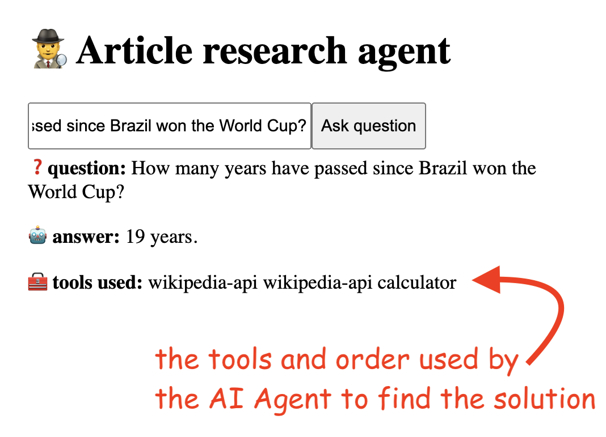
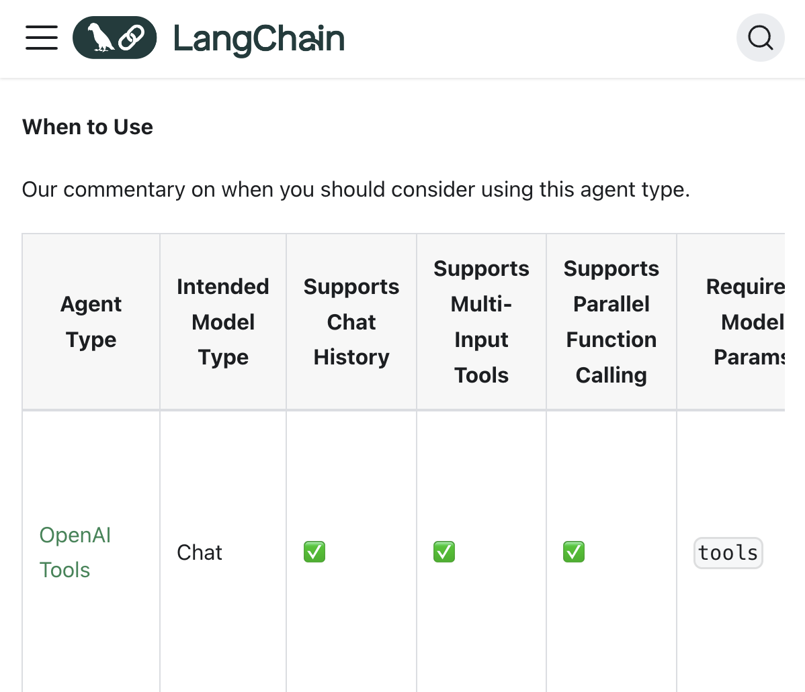

# 7. Agen AI

## 7.1. Pendahuluan dan pengaturan proyek

Sampai sekarang, kita telah melihat pembuatan chain. Chain mengikuti urutan yang telah ditentukan oleh kita.

Agen berbeda dalam artian kita dapat dengan mudah memberi mereka tujuan, dan mereka akan secara dinamis mencari tahu tindakan terbaik yang harus diambil dan urutan tindakan tersebut untuk mencapai tujuan akhir itu.

Kita akan menetapkan alat untuk agen, dan agen akan mencoba mencari tahu kapan harus menggunakan alat untuk menyelesaikan tugas.

Sampai saat ini, kita telah menggunakan LLM terutama sebagai alat NLP (Natural Language Processing). Agen AI lebih dekat dengan apa yang kita bayangkan sebagai "AI nyata".

Memiliki tujuan, mencoba pendekatan yang berbeda, berinteraksi dengan lingkungan, dan membuat keputusan lebih selaras dengan apa yang kita anggap sebagai kecerdasan nyata.

Kita ditugaskan untuk membangun alat untuk membantu jurnalis dalam penelitian mereka untuk artikel baru. Alat tersebut harus dapat mencari di Wikipedia dan melakukan perhitungan matematika yang tepat.

Pada akhir bab ini, kita akan membangun aplikasi yang akan melakukan hal berikut:

- membaca pertanyaan dari pengguna
- menggunakan agen untuk menjawab pertanyaan
- output akan berisi jawaban atas pertanyaan, dan alat yang digunakan oleh agen untuk menemukan jawaban itu.



Kita akan mulai dari keadaan berikut: di frontend, kita akan membiarkan pengguna mengetik pertanyaan dan mengirimkan pertanyaan itu ke server. Ketika respons tiba, kita akan menampilkan teksnya.

```javascript
// code/agents/src/app/page.js

"use client"

import { useState } from "react"

export default function Home() {
  const [data, setData] = useState()

  const onSubmitHandler = async (e) => {
    e.preventDefault()

    const question = e.target.question.value

    if (question) {
      const response = await fetch("api", {
        method: "POST",

        body: JSON.stringify({
          question,
        }),
      })

      const { data } = await response.json()

      setData(data)
    }
  }

  ;<>
    <h1>1 •♂ Agen penelitian artikel</h1>
    <form onSubmit={onSubmitHandler}>
      <input name="question" />

      <button>Ajukan pertanyaan</button>
    </form>

    <p>{data?.text}</p>
  </>
}
```

Di backend, kita akan menanyakan model GPT-4 Omni pertanyaan yang dimasukkan oleh pengguna.

```javascript
// code/agents/src/app/api/route.js

import { ChatOpenAI } from "@langchain/openai"
import { PromptTemplate } from "@langchain/core/prompts"
import { StringOutputParser } from "@langchain/core/output_parsers"

const model = new ChatOpenAI({
  modelName: "gpt-4o",

  openAIApiKey: process.env.OPENAI_API_KEY,
})

const prompt = new PromptTemplate({
  inputVariables: ["question"],

  template: "Jawab pertanyaan pengguna {question}",
})

const chain = prompt.pipe(model).pipe(new StringOutputParser())

export async function POST(req) {
  const { question } = await req.json()

  const data = await chain.invoke({
    question,
  })

  return Response.json({ data })
}
```

Versi awal aplikasi kita tampaknya berfungsi dengan cukup baik. Misalnya, jika kita
memintanya untuk menceritakan lelucon, semuanya berfungsi seperti yang diharapkan.


Tetapi bagaimana jika kita bertanya Siapa yang memenangkan Super Bowl pada tahun 2024? batasan kumpulan data pelatihan mulai muncul. Mengingat bahwa model telah dilatih pada data hingga Oktober 2023, ia tidak tahu jawabannya.


## 7.2. Membuat agen

Saatnya membuat agen pertama kita. Untuk mengatasi batasan yang diberlakukan oleh kumpulan data pelatihan, kita akan memberikan chatbot opsi untuk melakukan penelitiannya sendiri secara online.

Untuk melakukan pekerjaan mereka, agen memerlukan akses ke alat tertentu, seperti kemampuan pencarian Google atau Wikipedia. Dengan menggabungkan model GPT dengan alat-alat ini, agen menentukan tindakan yang diperlukan untuk mencapai tujuan mereka.

Jika kita memeriksa dokumentasi Alat, kita akan melihat daftar lengkap opsi yang tersedia https://js.langchain.com/docs/integrations/tools/.


Meskipun mungkin menggoda untuk memuat semua alat yang tersedia, penting untuk melengkapi agen hanya dengan yang diperlukan. Memberikan terlalu banyak opsi dapat menyebabkan satu atau lebih hal berikut:
agen memilih alat yang tidak sesuai
biaya per panggilan API yang lebih tinggi; agen akan menggunakan lebih banyak token
peningkatan latensi jaringan

Untuk kasus penggunaan kita, kita akan melengkapi agen hanya dengan 2 alat. Alat pencarian Wikipedia dan kalkulator matematika.

```javascript
const wikipediaQuery = new WikipediaQueryRun({ topKResults: 1 })

const calculator = new Calculator()

const tools = [wikipediaQuery, calculator]
```

Harap dicatat bahwa untuk alat Kalkulator, Anda perlu menginstal
paket @langchain/community:

```
npm install @langchain/community
```

Tunggu, apa!? Kalkulator matematika untuk model AI? Nah, karena jaringan saraf bekerja dengan memperkirakan sesuatu, mereka tidak hebat dalam matematika. Ada kemungkinan yang sangat kecil mereka akan mengacaukan operasi matematika dasar. Oleh karena itu, lebih aman dan lebih cepat untuk menggunakan alat matematika dasar untuk operasi ini.

Kumpulan alat ini akan diteruskan ke agen AI. Setiap jenis agen melayani tujuan unik, seperti yang terlihat dari dokumentasi: https://js.langchain.com/docs/modules/agents/agent_types/. Misalnya, Obrolan Terstruktur dioptimalkan untuk beberapa interaksi bolak-balik.

Kita akan menggunakan Agen ReAct, agen tindakan paling serbaguna. Sebagai catatan samping,
Agen ReAct tidak ada hubungannya dengan kerangka kerja JavaScript React.

Beginilah tampilan kode lengkap backend:

```javascript
// code/agents/src/app/page.js

import { ChatOpenAI } from "@langchain/openai"
import { WikipediaQueryRun } from "@langchain/community/tools/wikipedia_query_run"
import { createReactAgent, AgentExecutor } from "langchain/agents"
import { Calculator } from "@langchain/community/tools/calculator"
import { pull } from "langchain/hub"

const model = new ChatOpenAI({
  modelName: "gpt-4o",

  openAIApiKey: process.env.OPENAI_API_KEY,
})

// ! membuat kotak alat untuk agen
// ! ingat untuk menjalankan 'npm install @langchain/community'
const wikipediaQuery = new WikipediaQueryRun({ topKResults: 1 })

const calculator = new Calculator()

const tools = [wikipediaQuery, calculator]

// ! mendapatkan aturan agen
const prompt = await pull("hwchase17/react")

// ! mendefinisikan Agen dan AgentExecutor
const agent = await createReactAgent({
  llm: model,

  tools,

  prompt,
})

const agentExecutor = new AgentExecutor({
  agent,

  tools,
})

export async function POST(req) {
  const { question } = await req.json()

  const response = await agentExecutor.invoke({
    input: question,
  })

  return Response.json({ data: response, prompt })
}
```

Dan ini adalah kode frontend:

```javascript
// code/agents/src/app/page.js

"use client"

import { useState } from "react"

export default function Home() {
  const [data, setData] = useState()

  const onSubmitHandler = async (e) => {
    e.preventDefault()

    const question = e.target.question.value

    if (question) {
      const response = await fetch("api", {
        method: "POST",

        body: JSON.stringify({
          question,
        }),
      })

      const { data } = await response.json()

      setData(data)
    }
  }

  return (
    <>
      <h1>1 •♂ Agen penelitian artikel</h1>
      <form onSubmit={onSubmitHandler}>
        <input name="question" />

        <button>Ajukan pertanyaan</button>
      </form>

      {data && (
        <div>
          <p>
            <b>❓ pertanyaan:</b> {data.input}{" "}
          </p>

          <p>
            <b># jawaban:</b> {data.output}{" "}
          </p>
        </div>
      )}
    </>
  )
}
```

Pada saat ini, jika kita bertanya lagi kepada model Siapa yang memenangkan Super Bowl pada tahun 2024? ia akan dapat menggunakan alat Wikipedia untuk mencari jawaban.


Oh, Taylor Swift pasti senang!

## 7.3. Memantau agen dan pertimbangan kinerja

Agen sangat fantastis, tetapi mereka datang dengan biaya. Mereka bisa:

- lambat merespons
- memiliki biaya komputasi yang tinggi
- terkadang dapat memberikan hasil acak

Untungnya, kita memiliki beberapa cara untuk mengontrol perilaku otonom agen.

Mari kita perbarui kode backend dengan beberapa peningkatan pemantauan dan kinerja.

Tambahkan baris berikut di konstruktor AgentExecutor:

```javascript
// code/agents/src/app/api/route.js

const agentExecutor = new AgentExecutor({
  agent,

  tools,

  verbose: true,

  returnIntermediateSteps: true,

  maxIterations: 4,
})
```

Dan kode ini di HTML yang dikembalikan dari frontend:

```jsx
data && (
  <div>
    <p>
      <b>❓ pertanyaan:</b> {data.input}{" "}
    </p>
    <p>
      <b># jawaban:</b> {data.output}{" "}
    </p>
    <p>
      <b>5 alat yang digunakan:</b> {data.intermediateSteps.map((step) => step.action.tool)}
    </p>
  </div>
)
```

Pada titik ini, jika kita bertanya kepada agen, "Berapa tahun telah berlalu sejak Brasil memenangkan Piala Dunia?" kita akan mendapatkan hasil berikut:


Mari kita bahas sedikit tentang perubahan yang ditambahkan.

Pertama, opsi `maxIterations` membatasi jumlah upaya yang dimiliki agen untuk menemukan solusi. Ini adalah opsi yang baik untuk mempercepat respons dan untuk memastikan kita tidak mengalami loop tak terbatas.

Seperti dalam kasus penggunaan sebelumnya, opsi `verbose` mencetak - di konsol backend - penalaran yang mengarah ke hasil tertentu. Misalnya, ketika ditanya, "Berapa dua kali PI?" ia akan mencetak sesuatu seperti ini:

```
[chain/start] [1:chain:AgentExecutor > 18:chain:ReactAgent >
22:prompt:PromptTemplate] Memasuki Chain run dengan input: {
"input": "Berapa dua kali PI?",
"steps": [
{
"action": {
"tool": "wikipedia-api",
"toolInput": "PI",
"log": "PI adalah konstanta matematika yang dapat ditemukan di
Wikipedia\nAction: wikipedia-api\nAction Input: PI"
},
{
"action": {
"tool": "calculator",
"toolInput": "2*3.14159",
"log": "Saya tahu bahwa PI kira-kira sama dengan 3.14159,
jadi saya bisa menghitung dua kalinya\nAction: calculator\nAction
Input: 2*3.14159"
},
],
"content": "Saya sekarang tahu jawaban akhirnya\nFinal Answer:
6.28318"
}
```

Ini cukup keren, bukan?

Dan opsi ketiga, `returnIntermediateSteps` (tautan dokumentasi di sini) mencetak alat yang digunakan oleh agen dan urutannya. Agen bersifat otonom dan dapat memutuskan serangkaian tindakan mereka sendiri.

Misalnya, alat Wikipedia sudah cukup untuk menjawab pertanyaan, "Siapa yang memenangkan Super Bowl pada tahun 2024?" Di sisi lain, pertanyaan, "Berapa tahun telah berlalu sejak Brasil memenangkan Piala Dunia?" membutuhkan penggunaan alat Wikipedia dan Kalkulator. Dengan opsi ini, kita dapat memantau apakah agen menggunakan alat yang benar untuk pekerjaan itu.

## 7.4. Rekap

Agen dan penggunaan alat secara umum, adalah konsep kunci LangChain.

Pada tingkat tinggi, agen melibatkan penggunaan LLM dan memintanya untuk bernalar tentang tindakan apa yang harus diambil dan kemudian mengeksekusi tindakan tersebut. Seringkali ini dilakukan dalam loop yang berulang sampai LLM memutuskan telah mencapai tujuan, atau tidak ada tindakan lain yang dapat diambil.

Alat adalah representasi tindakan yang dapat diambil oleh model bahasa, bersama dengan fungsi yang mengimplementasikan tindakan tersebut.

Agen dan alat digabungkan dengan eksekutor agen. Eksekutor agen ini pada dasarnya adalah loop yang berjalan untuk memanggil LLM untuk mencari tahu alat apa yang harus dicoba digunakan agen selanjutnya kecuali telah mencapai tujuannya.

Agen dibangun berdasarkan prompt, seperti yang mungkin Anda perhatikan dari kode:

```javascript
const prompt = await pull("hwchase17/react")

const agent = await createReactAgent({
  llm: model,

  tools,

  prompt,
})
```

Ada banyak jenis agen yang berbeda. Anda dapat melihat lima jenis agen utama yang tersedia saat ini di halaman ini:



Beberapa bagus untuk model lokal, beberapa bagus untuk model OpenAI terbaru, beberapa mendukung panggilan fungsi paralel, dan beberapa mendukung riwayat percakapan. Yang lain bagus untuk menggunakan alat sederhana dan input tunggal karena strategi prompting umum mereka.

Saat membahas agen AI, harap dicatat bahwa ada banyak topik, konsep, teknik, prompt, dan fitur lain. Apa yang telah kita bahas dalam bab ini hanyalah pengantar yang sangat singkat untuk subjek tersebut.

## 7.5. Kata Penutup

Semoga Anda menikmati buku ini!

Saya akan senang mendapatkan umpan balik Anda. Beri tahu saya apa yang Anda suka dan tidak suka sehingga saya dapat meningkatkan buku ini.

Saya akan senang mendapatkan umpan balik Anda, dan mempelajari apa yang Anda suka dan tidak suka sehingga saya dapat meningkatkan buku ini.

Jangan ragu untuk mengirim email kepada saya di daniel@js-craft.io untuk mendapatkan versi terbaru dari buku ini. Jika Anda berpikir saya seharusnya membahas lebih banyak topik, silakan kirim email kepada saya. Saya akan senang mendengar dari Anda!

Jika Anda menyukai buku ini, saya akan menghargai jika Anda juga dapat meninggalkan ulasan.

Terima kasih, teman dan teruslah coding!
